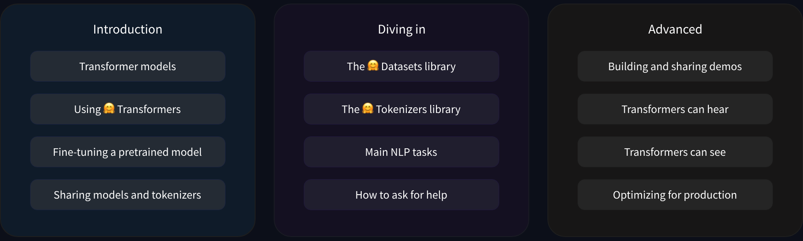

# Transformers Course

This repo keeps the [Hugging Face 🤗 Tranformer's course](https://huggingface.co/learn/nlp-course/chapter1/1).

<details open>
<summary> Local installation</summary>
For a local environment Hugging Face recommends to install the development version, using the pip package manager

    pip install "transformers[sentencepiece]"

</details>


<details open>
<summary> 1. Tranformer models</summary>

##### Introduction

Course overview



Prior requirements:
* Python
* Deep learning (Basic understanding)
* Does not expect prior Pytorch or Tensorflow knowledge

Course reference

    @misc{huggingfacecourse,
    author = {Hugging Face},
    title = {The Hugging Face Course, 2022},
    howpublished = "\url{https://huggingface.co/course}",
    year = {2022},
    note = "[Online; accessed <today>]"
    }


##### Natural Lenguage Processing
Natural Language Processing NLP is a field of linguistic machine learning focused on understanding everything related to human language. 
The aim of NLP tasks is not only to understand words individually, but to be able to understand the context of those words.

Some NLP tasks could be:
- Text Classification 
- Token Classification 
- Table Question Answering 
- Question Answering 
- Zero-Shot Classification 
- Translation 
- Summarization 
- Conversational 
- Text Generation 
- Text2Text Generation 
- Fill-Mask 
- Sentence Similarity

##### Transformers, what can they do?
Transformers models are used to solve all kinds of NLP tasks listed on the before section. 
Organizations line Facebook, Google, Microsoft, etc. use and contribute 🤗 Transformer models.

* Working with pipelines
Pipelines are the most basic object in the 🤗 library is the `pipeline()` function. It connects a model with its pre-processing and post-processing steps, allowing us to directly input any text and get an intelligible answer.
Some of the available pipelines are:
- sentiment-analysis

```python
classifier = pipeline(task="sentiment-analysis")
```
- Named Entity Recognition "ner"
```python
from transformers import pipeline
from transformers import AutoTokenizer, AutoModelForTokenClassification

tokenizer = AutoTokenizer.from_pretrained("d4data/biomedical-ner-all")
model = AutoModelForTokenClassification.from_pretrained("d4data/biomedical-ner-all")
ner_pipe = pipeline("ner", model=model, tokenizer=tokenizer, aggregation_strategy="simple")
ner_diagnostic_result = ner_pipe("A male patient with a history of diabetes, hypertension, and hyperlipidemia presents with chest pain")
print(ner_diagnostic_result)
```
- fill-mask
``` python
from transformers import pipeline

unmasker = pipeline("fill-mask")
mask_filled_list = unmasker("Sydney is an <mask> city.")
mask_filled_list.sort(key=lambda x: x['score'], reverse=True)
for item in mask_filled_list:
    print(item['sequence'], item['score'])
```

</details>

<details>
<summary>2. Using 🤗 Transformers</summary>
content... 
</details>

<details>
<summary>3. Local installation</summary>
content... 
</details>
